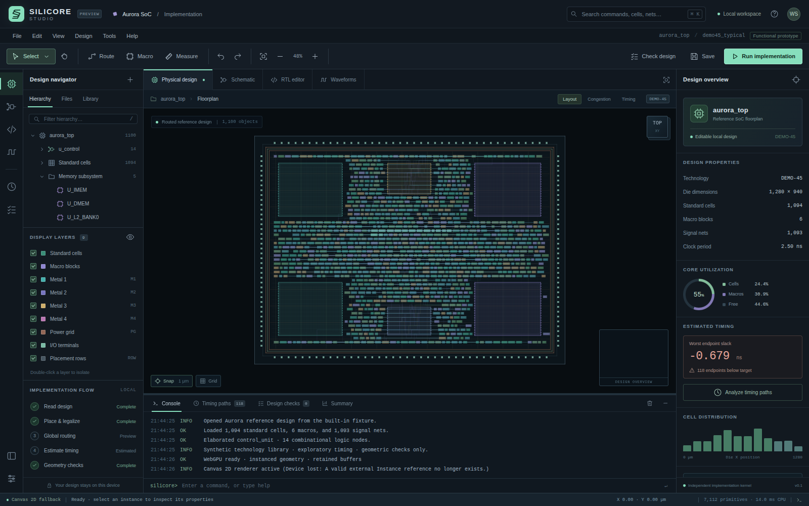

# Silicore Studio

[**Launch Silicore Studio**](https://wieslawsoltes.github.io/SilicoreStudio/) · [Source repository](https://github.com/wieslawsoltes/SilicoreStudio)

**A dependency-free electronic-design workbench with an editable physical database, a retained WebGPU layout renderer, an RTL compiler, schematic editing, and worker-based implementation tools.**

Version 0.1.0 · Independent functional prototype · MIT license



Silicore uses an EDA desktop-style layout inspired by physical-implementation workflows: hierarchy on the left, a large central design canvas, properties on the right, and implementation reports below. It is independently implemented and has no affiliation with Synopsys. No proprietary code, icons, libraries, or technology files are included.

## Start the application

The release contains **`dist/silicore-studio.html`**, a single self-contained file with its stylesheet, shaders, kernel, application code, and Blob worker embedded. Open it in a modern browser. No packages, compilation, account, CDN, or application server are required for that file. Browser file-origin policies can affect WebGPU, workers, and local persistence; use a localhost origin for development and dependable capability detection.

From this source directory:

```sh
python3 -m http.server 8080
```

Open `http://localhost:8080/`. This serves the modular source application. The standalone build is also available at `http://localhost:8080/dist/silicore-studio.html`.

WebGPU is capability-detected. A supported browser, an available adapter, and a secure context are needed for the GPU path. Unsupported environments use the working Canvas 2D renderer. Read the actual backend in the lower-left status bar; it is never inferred from the browser name.

### Build and test

The build and kernel tests use Node.js built-ins only. Node 22.16.0 was used for this release.

```sh
npm test
npm run build
```

Neither command needs `npm install`. The build writes `dist/silicore-studio.html`.

The source `index.html` uses relative ES module imports and should be served. The bundled HTML has no external module imports.

## What is implemented

| Area | Working behavior |
| --- | --- |
| Physical design | Spatial picking; single and multiple selection; box selection; cell movement; fixed-instance protection; macro creation, movement and corner resizing; editable coordinates and dimensions; duplicate and delete; physical net creation; snap; pointer-anchored zoom; pan; minimap; distance measurement. |
| Rendering | Instanced WebGPU rectangles and Manhattan wires, retained GPU buffers, WGSL shader, on-demand frames, layer visibility and isolation, congestion overlay, timing-path highlighting, high-zoom labels, Canvas 2D fallback, separate interaction/text overlay. |
| Design database | Versioned JSON, typed object kinds, stable IDs, bounds/reference validation, spatial index, bounded undo/redo transactions, rollback after failed edits, revision-checked worker results. |
| RTL | Editable source, syntax highlighting, line numbers, structured errors, bounded combinational Verilog subset, unsigned bus evaluation, gate graph generation, mapping into the physical control block. |
| Schematic | Gate symbols, level-based layout, signal values, input toggles, manual node arrangement, gate insertion/type changes/deletion, pin rewiring, cycle rejection, HDL regeneration, physical cross-probing. |
| Simulation | Deterministic two-state combinational samples, unsigned 1–32-bit values, scalar and bus waveform views, cursor, stepping, reset, VCD export. |
| Implementation | Row legalization, fixed-macro exclusion, coarse A* Manhattan routing around macro obstacles, synthetic-delay timing estimates, die/placement/connectivity/width checks. These operate on the current database rather than returning canned reports. |
| Files | Native `.silicore` JSON import/export; `.v`/`.sv` import of the supported subset; Verilog export; DEF placement export and matching-component placement import; layout SVG export; waveform VCD export. |
| Workspace | Searchable hierarchy, cell library, command palette, console commands, timing and check tables, settings, local autosave where permitted, keyboard shortcuts, desktop-responsive panels. |

## Reference design and its meaning

The initial **Aurora** floorplan contains **1,094 standard cells, six macros, and 1,093 physical nets**, on a **1,280 × 940 µm** die. Its initial render contains 7,112 rectangular primitives. The fixture is deterministic and has no initial placement-overlap violations.

This is a **synthetic floorplan**, not an implemented CPU or a foundry design. Memory capacities in macro captions are illustrative metadata; SRAM, ROM, and PLL behavior is not simulated. `DEMO-45` is a synthetic library label, not a process-design kit.

The initial `control_unit` RTL elaborates to 14 graph nodes, including assignment buffers. Those nodes are associated with 14 physical control cells. The initial background physical connectivity is independently generated; it is not an extracted netlist for the whole displayed chip. Synthesizing RTL or editing the schematic replaces the mapped control cells and creates their internal gate-to-gate connections, leaving unrelated floorplan objects in place. Top-level HDL inputs and outputs are schematic ports, not modeled physical I/O pad cells. The decorative perimeter terminals and power-ring geometry are not electrically extracted nets.

The initial negative timing slack is calculated from the synthetic physical graph and delay model. It is not a measured silicon result or a comparison against a commercial tool.

## First working session

1. Select a standard cell and drag it. Inspect its coordinates, then undo. Select a macro through the hierarchy, clear **Fixed**, and move or resize it.
2. Open **Schematic**. Click primary inputs to change their values. Select a gate to change its operation. Click an output pin followed by an input pin to rewire. A cycle is rejected without committing the edit.
3. Open **RTL editor**, edit a continuous assignment, and choose **Synthesize** or press `Ctrl/Command+Enter`. Inspect the new schematic or mapped physical cells.
4. Choose **Run implementation**. Placement, coarse routing, timing estimation, and geometry checks execute in a worker. Inspect reported failures rather than assuming the router always completes every connection.
5. Run **Simulate**, inspect waveforms, and export the native project or VCD through the File menu. Native project export preserves the last valid model and the current RTL draft separately.

## Supported HDL subset

The compiler accepts one ANSI-style module with `input`, `output`, optional `wire`/`logic`, internal wire declarations, and continuous assignments. Signals are unsigned scalars or descending buses `[N:0]` with 1–32 bits.

Supported expressions are identifiers, parentheses, constants, constant bit selects, `~`, `!`, `&`, `|`, `^`, `&&`, `||`, `+`, `-`, `==`, `!=`, and `condition ? a : b`. Width-bounded results are unsigned; destination widths truncate outputs. Forward assignments are resolved. Duplicate drivers, unresolved reachable signals, cyclic logic, invalid literal digits, and out-of-range bit selects are rejected.

```verilog
module adder (
    input  wire [7:0] a,
    input  wire [7:0] b,
    output wire [7:0] sum,
    output wire       different
);
    assign sum = a + b;
    assign different = a != b;
endmodule
```

For `a = 250`, `b = 10`, this produces `sum = 4`, `different = 1`. The included tests exercise this through both the kernel and browser worker.

**Not implemented:** sequential `always` blocks, flip-flop simulation, clocks/event queues, delays, four-state `X`/`Z` semantics, signed expressions, parameters/generate, full concatenation/slicing, multiple modules, hierarchical instantiation, full IEEE Verilog/SystemVerilog semantics, or real technology mapping. Files with a `.sv` extension are not thereby treated as fully supported SystemVerilog. Unreachable assignments are not elaborated into output logic. The graph serializer preserves manual graph nodes in native JSON, while a subsequent source compilation may eliminate unreachable logic and add assignment buffers.

## Keyboard and console

| Command | Shortcut |
| --- | --- |
| Select / pan / connect / macro / measure | `V` / `H` / `R` / `B` / `D` |
| Temporary pan; fit | Hold `Space`; `F` |
| Zoom | Wheel about pointer; `+` / `-` |
| Extend selection | `Shift` + click/box selection |
| Undo / redo | `Ctrl/Command+Z`; `Ctrl/Command+Shift+Z` |
| Duplicate / select all | `Ctrl/Command+D`; `Ctrl/Command+A` |
| Save / open native project | `Ctrl/Command+S`; `Ctrl/Command+O` |
| Command palette | `Ctrl/Command+K` |
| Compile RTL | `Ctrl/Command+Enter` inside editor |
| Delete; cancel connection/tool gesture | `Delete`; `Escape` |
| Hierarchy search; console focus | `/`; backtick |

The console is a bounded application command dispatcher, **not a Tcl interpreter or JavaScript evaluator**:

```text
help
report_timing
check_design
place_design
route_design
synthesize
simulate
fit
select U_IMEM
set_clock 3.0
set_layer M1 off
save
clear
```

## File interchange and persistence

Native JSON is the complete supported project format. Imports normalize fields and validate IDs, geometry, references, logic types, widths, counts, and cycles. The file picker caps imports at 32 MiB. Library gate names must be own properties, not inherited object keys. The spatial index uses bounded bucket enumeration with a large-object fallback.

DEF is deliberately **placement-only**. Export emits component placements in 1,000 database units per micron. Import applies matching component names with `N` orientation. It is not a general LEF/DEF parser, netlist importer, detailed-routing interchange, or library resolver. No foundry libraries accompany the fictitious cell references.

SVG exports the physical layout, including selected layer visibility. VCD exports sampled values using a 1 ns interchange spacing; that timestamp choice does not add propagation-delay or sequential semantics.

Autosave uses browser local storage. Storage can be unavailable, partitioned, full, or cleared by browser policy; the app reports failure and native export remains available. There are no application-origin network requests, telemetry, cloud saves, or embedded third-party services. Hosting the app still entails the host's ordinary page delivery/logging.

## Validation performed

**54 kernel tests pass.** Coverage includes all 32 reference-control input combinations, bus arithmetic, compiler rejection paths, graph serialization/name collisions, deep iterative traversal, geometry checks, placement/routing, schema and DEF round-trips, bounded spatial queries, history, camera transforms, and instance data.

**21 browser integration checks pass**, using Chromium 144.0.7559.96 and Playwright with a 1,600 × 1,000 viewport and a 1,280 × 800 layout check. They exercise actual UI gestures, worker compilation, failed cyclic wiring, simulation, the full implementation flow, file download/import, invalid imports, command invocation, and zero uncaught page exceptions.

The automated environment rendered the standalone document on an opaque origin. **Canvas 2D was tested; browser WebGPU and persistent local storage were unavailable there. The WebGPU path is implemented but has not been hardware/browser-validated in this release.** No GPU throughput, frame-rate, signoff-equivalence, or large-production-design performance claim is made. The displayed CPU render duration is not a GPU timing measurement.

Reports are in `test-results/`; screenshots are in `assets/`.

For served-origin browser testing, install the separate test-only Playwright dependency and point the script at your Chromium executable:

```sh
python -m pip install playwright
python tests/browser_smoke.py --url http://localhost:8080 \
    --browser /path/to/chromium --output test-results-local
```

For local inline-document regression testing:

```sh
python tests/browser_smoke.py --inline dist/silicore-studio.html \
    --browser /path/to/chromium --output test-results-local
```

## Engineering scope

This is an inspectable application and kernel foundation, **not a replacement for Fusion Compiler, VCS, PrimeTime, Custom Compiler, or a complete commercial EDA suite**. No GDSII/OASIS, real Liberty/LEF technology mapping, parasitic extraction, SDC timing semantics, setup/hold analysis, clock-tree synthesis, analog/SPICE solving, power integrity, LVS, foundry DRC, antenna checks, or tapeout qualification is implemented.

See **[ARCHITECTURE.md](ARCHITECTURE.md)** for the rendering ABI, model/worker contracts, algorithms, and extension boundaries.

## References

- Synopsys Fusion Compiler product scope: https://www.synopsys.com/implementation-and-signoff/physical-implementation/fusion-compiler.html
- WebGPU specification: https://www.w3.org/TR/webgpu/
- WebGPU API and security requirements: https://developer.mozilla.org/en-US/docs/Web/API/WebGPU_API

These are external product/API references, not dependencies or endorsements.
